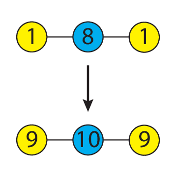
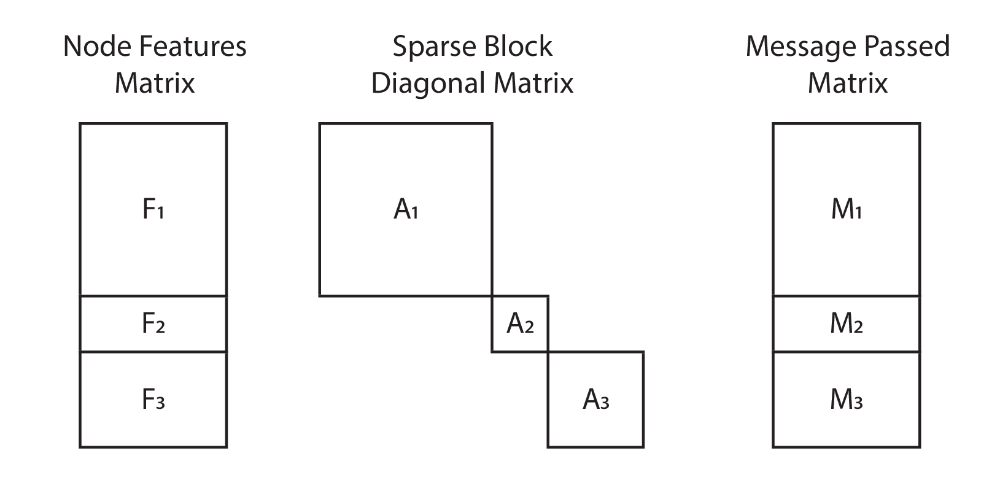
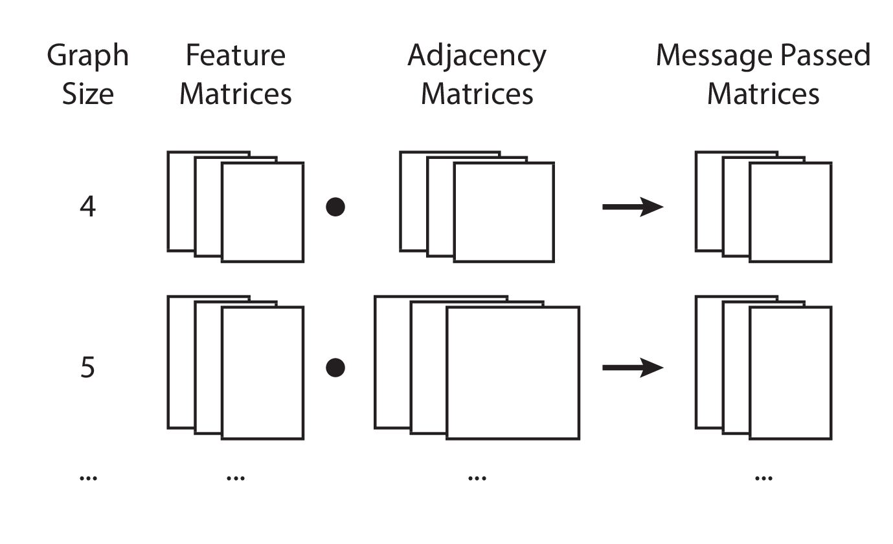
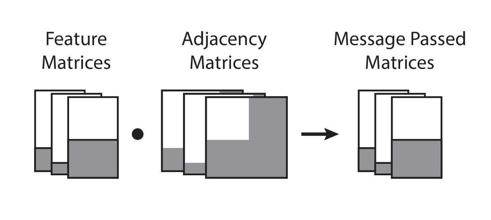

**Abstract:** Message passing on graphs,
also known as graph convolutions,
have become a popular research topic.
In this piece,
I aim to provide a short technical primer
on ways to implement message passing on graphs.
The goal is to provide clear pedagogy
on what message passing means mathematically,
and hopefully point towards cleaner computational implementations
of the key algorithmic pieces.

**Assumed knowledge:**
We assume our reader has familiarity with elementary graph concepts.
More specifically, the terms “graph”, “nodes”, and “edges”
should be familiar terms.
Code examples in this technical piece will be written
using the Python programming language,
specifically using Python 3.7, NumPy 1.17 (in JAX), and NetworkX 2.2.

## Introduction to Message Passing

### Functions on Nodes

Message passing starts with a “function defined over nodes”,
which we will denote here as `f(N)` (for “function of node N”).
What is this, one might ask?
In short,
this is nothing more than a numeric value of some kind
attached to every node in a graph.
This value could be scalar, vector, matrix, or tensor.

The semantic meaning of that value
is typically defined by the application domain
that the graph is being used in.
As a concrete example,
in molecules, a “function” defined over the molecular graph
could be the scalar-valued proton number.
Carbon would be represented by the function `f(N) = 6`.
Alternatively, it could be a vector of values
encompassing both the atomic mass and the number of valence electrons.
In this case, carbon would be represented by the function `f(N) = (6, 4)`.

Visually, one might represent it as follows:

<!-- \<FIGURE\> -->


### Message Passing

What then is message passing, or,
as the deep learning community has adopted, “graph convolution”?
At its core, message passing is nothing more
than a generic mathematical operation
defined between a node’s function value
and its neighbors function value.

As an example,
one may define a message passing operation
to be the summation the function evaluated at a node
with the function evaluated on its neighbor’s nodes.
Here is a simplistic example,
shown using a scalar on water:



Summation is not the only message passing operation that can be defined.
In principle,
given any node `N` and its neighbors `neighbors(N)` values,
we may write down a generic function `f(N, neighbors(N))`
that defines how the function value on each node
is to be shared with its neighbors.

## Computational Implementations of Message Passing

For simplicity,
let us stay with the particular case
where the message passing operation is defined as
the summation of one’s neighbors values with one’s values.

### Object-Oriented Implementation

With this definition in place,
we may then define a message passing operation in Python as follows:

```python
def message_passing(G):
    """Object-oriented message passing operation."""

    G_new = G.copy()

    for node, data in G.nodes(data=True):
        new_value = data["value"]  # assuming the value is stored under this key
        neighbors = G.neighbors(node)
        for neighbor in neighbors:
            new_value += G.nodes[neighbor]["value"]
        G_new.node[node]["value"] = new_value
    return G
```

Thinking about computational considerations,
we would naturally consider this implementation to be slow,
because it involves a for-loop over Python objects.
If we had multiple graphs
over which we wanted message passing to be performed,
the type-checking overhead in Python will naturally accumulate,
and may even dominate.

### Linear Algebra Implementation

How might we speed things up? As it turns out, linear algebra may be useful.

We know that every graph may be represented as an adjacency matrix `A`,
whose shape is `(n_nodes, n_nodes)`.
As long as we maintain proper node ordering,
we may also define a compatibly-shaped matrix `F` for node values,
whose shape is `(n_nodes, n_features)`.

Taking advantage of this,
in order define the “self plus neighbors” message passing operation
in terms of linear algebra operations,
we may then modify `A` by adding to it a diagonal matrix of ones.
(In graph terminology,
this is equivalent to adding a self-loop to the adjacency matrix.)

Then, message passing,
as defined above,
is trivially the dot product of `A` and `F`:

```python
def message_passing(A, F):
    """
    Message passing done by linear algebra.

    :param A: Adjacency-like matrix, whose shape is (n_nodes, n_nodes).
    :param F: Feature matrix, whose shape is (n_nodes, n_features).
    """

    return np.dot(A, F)
```

In principle, variants on the adjacency matrix are possible.
The only hard requirement for the matrix `A`
is that it has the shape `(n_nodes, n_nodes)`.

#### Adjacency Variant 1: N-degree adjacency matrix

The adjacency matrix represents connectivity by degree 1.
If we take the second matrix power of the adjacency matrix,
we get back the connectivity of nodes
at two degrees of separation away.
More generically:

```python
def n_degree_adjacency(A, n: int):
    """
    Return the n-degree of separation adjacency matrix.

    :param A: Adjacency matrix, of shape (n_nodes, n_nodes)
    :param n: Number of degrees of separation.
    """
    return np.linalg.matrix_power(A, n)
```

Performing message passing using the N-degree adjacency matrix
effectively describes sharing of information
between nodes that are N-degrees of separation apart,
skipping intermediate neighbors.

#### Adjacency Variant 2: Graph laplacian matrix

The graph laplacian matrix is defined as
the diagonal degree matrix `D`
(where the diagonal entries are the degree of each node)
minus the adjacency matrix `A`: `L = D - A`.

This matrix is the discrete analog to the Laplacian operator,
and can give us information
about the discrete gradient between a node and its neighbors.

## Message Passing on Multiple Graphs

Thus far,
we have seen an efficient implementation
of message passing on a single graph
using linear algebra.

How would one perform message passing on multiple graphs, though?

This is a question
that has applications in graph neural networks
(especially in cheminformatics).
For the learning task where one has a batch of graphs,
and the supervised learning task is
to predict a scalar (or vector) value per graph,
knowing how to efficiently message pass over multiple graphs
is crucial to developing a performant graph neural network model.

The challenge here, though,
is that graphs generally are of variable size,
hence it is not immediately obvious how to “tensorify” the operations.

Let us look at a few alternatives,
starting with the most obvious (but also most inefficient),
building towards more efficient solutions.

### Implementation 1: For-loops over pairs of adjacency and feature matrices

If we multiple graphs,
they may be represented as a list of feature matrices
and a list of adjacency matrices.
The message passing operation, then,
may be defined by writing a for-loop over pairs of these matrices.

```python
def message_passing(As, Fs):
    outputs = []
    for A, F in zip(As, Fs):
        outputs.append(np.dot(A, F))
    return outputs
```

Because of the for-loop,
the obvious downside here
is the overhead induced by running a for-loop over pairs of As and Fs.

### Implementation 2: Sparse Matrices

Sparse matrices are an attractive alternative.
Instead of treating graphs as independent samples,
we may treat them as a single large graph on which we perform message passing.
If we order the nodes in our adjacency matrix and feature matrix correctly,
we will end up with a block diagonal adjacency matrix,
and vertically stacked feature matrices.



If we prepare the multiple graphs as a large disconnected graph,
then we will have a dense feature matrix of shape `(sum(n_nodes), n_feats)`,
and a sparse adjacency matrix of shape `(sum(n_nodes), sum(n_nodes))`.
Message passing then becomes a sparse-dense dot product:

```python
def message_passing(A, F):
    return sparse.dot(A, F)
```

The upside here is that
message passing has been returned back to its natural form (a dot product).
The downsides here are that the data must be prepared as a single large graph,
hence we effectively lose
what one would call the “sample” (or “batch”) dimension.
Additionally, the most widely used deep learning libraries
do not support automatic differentiation
on sparse-dense or dense-sparse dot products,
hence limiting the use of this implementation in deep learning.

### Implementation 3: Size-batched matrix multiplication

An alternative way to conceptualize message passing
is to think of graphs of the same size as belonging to a “size batch”.
We may then vertically stack the feature and adjacency matrices
of graphs of the same size together,
and perform a batched matrix multiplication,
ensuring that we preserve the sample/batch dimension in the final result.



In terms of Python code, this requires special preparation of the graphs.

```python
from collections import defaultdict
from jax.lax import batch_matmul

def feature_matrix(G):
    # ...
    return F

def prep_data(Gs: list):
    adjacency_matrices = defaultdict(list)
    feature_matrices = defaultdict(list)
    for G in Gs:
        size = len(G)
        F = feature_matrix(G)
        A = nx.adjacency_matrix(G) + np.ones(size)
        adjacency_matrices[size].append(A)
        feature_matrices[size].append(A)

    for size, As in adjacency_matrices.items():
        adjacency_matrices[size] = np.stack(As)
    for size, Fs in feature_matrices.items():
        feature_matrices[size] = np.stack(Fs)
    return adjacency_matrices, feature_matrices


def message_passing(As, Fs):
    result = dict()
    for size in As.keys():
        F = Fs[size]
        A = As[size]

        result[size] = batch_matmul(A, F)
    return result
```

In this implementation,
we use `jax.lax.batch_matmul`,
which inherently assumes
that the first dimension is the sample/batch dimension,
and that the matrix multiplication happens on the subsequent dimensions.

An advantage here is that the number of loop overhead calls in Python
is reduced to the number of unique graph sizes that are present in the graph.
The disadvantage, though,
is that we have a dictionary data structure that we have to deal with,
which makes data handling in Python less natural
when dealing with linear algebra libraries.

### Implementation 4: Batched padded matrix multiplication

In this implementation,
we prepare the data in a different way.
Firstly, we must know the size of the largest graph ahead-of-time.

```python
size = ...  # largest graph size
```

We then pad every graph’s feature matrix with zeros along the node axis
until the node axis is as long as the largest graph size.

```python
def prep_feats(F, size):
    # F is of shape (n_nodes, n_feats)
    return np.pad(
        F,
        [
            (0, size - F.shape[0]),
            (0, 0)
        ],
    )
```

We do the same with every adjacency matrix.

```python
def prep_adjs(A, size):
    # A is of shape (n_nodes, n_nodes)
    return np.pad(
        A,
        [
            (0, size-A.shape[0]),
            (0, size-A.shape[0]),
        ],
    )
```

Finally, we simply stack them into the data matrix:

```python
As = np.stack([prep_adjs(A, size) for A in As]
Fs = np.stack([prep_feats(F, size) for F in Fs]
```

Now, the shapes of our matrices are as follows:

- `F` takes on the shape `(n_graphs, n_nodes, n_feats)`
- `A` takes on the shape `(n_graphs, n_nodes, n_nodes)`

If we desire to be semantically consistent with our shapes,
then we might, by convention,
assign the first dimension to be the sample/batch dimension.

Finally, message passing is now trivially defined as a batch matrix multiply:

```python
def message_passing(A, F):
    return batch_matmul(A, F)
```

Visually, this is represented as follows:



To this author’s best knowledge,
this should be the most efficient implementation of batched message passing
across multiple graphs
that also supports automatic differentiation,
while also maintaining parity with the written equation form,
hence preserving readability.
The problems associated with a for-loop,
sparse matrix multiplication,
and dictionary carries,
are removed.
Moreover, the sample/batch dimension is preserved,
hence it is semantically easy to map each graph
to its corresponding output value.
Given the current state of automatic differentiation libraries,
no additional machinery is necessary to support sparse matrix products.

The only disadvantage that this author can think of
is that zero-padding may not be intuitive at first glance,
and that the data must still be specially prepared and stacked first.

## Concluding Words

This essay was initially motivated
by the myriad of difficult-to-read message passing implementations
present in the deep learning literature.
Frequently,
a for-loop of some kind is invoked,
or an undocumented list data structure is created,
in order to accomplish the message passing operation.
Moreover, the model implementation
is frequently not separated from the data preparation step,
which makes for convoluted
and mutually incompatible implementations
of message passing in neural networks.

It is my hope that while the research field is still in vogue,
a technical piece that advises researchers
on easily-readable and efficient implementations
of message passing on graphs
may help advance research practice.
In particular,
if our code can more closely match the equations listed in papers,
that will help facilitate
communication and verification of model implementations.

To help researchers get started,
an example implementation for the full data preparation
and batched padded matrix multiplies in JAX
is available on GitHub,
archived on Zenodo.

## Acknowledgments

I thank Rif. A. Saurous
for our discussion at the PyMC4 developer summit in Montreal, QC,
where his laser-like focus on “tensorify everything”
inspired many new thoughts in my mind.

Many thanks to my wife, Nan Li,
who first pointed me to the linear algebra equivalents of graphs.

I also thank David Duvenaud and Matthew J. Johnson
for their pedagogy while they were at Harvard.

## Appendix

### Equivalence between padded and non-padded message passing.

To readers who may need an example to be convinced
that matrix multiplying the padded matrices
is equivalent to matrix multiplying the originals,
we show the Python example below.

Firstly, without padding:

```python
F = np.array([[1, 0], [1, 1]])
A = np.array([[1, 0], [0, 1]])
M = np.dot(A, F)

# Value of M
# DeviceArray([[1, 0],
            #  [1, 1]], dtype=int32)
```

And now, with padding:

```python
pad_size = 2
F_pad = np.pad(
    F,
    pad_width=[
        (0, pad_size),
        (0, 0),
    ]
)
A_pad = np.pad(
    A,
    pad_width=[
        (0, pad_size),
        (0, pad_size),
    ]
)

# F_pad:
# DeviceArray([[1, 0],
#              [1, 1],
#              [0, 0],
#              [0, 0]], dtype=int32)

# A_pad:
# DeviceArray([[1, 0, 0, 0],
#              [0, 1, 0, 0],
#              [0, 0, 0, 0],
#              [0, 0, 0, 0]], dtype=int32)

M_pad = np.dot(A_pad, F_pad)
# M_pad:
# DeviceArray([[1, 0],
#              [1, 1],
#              [0, 0],
#              [0, 0]], dtype=int32)
```
